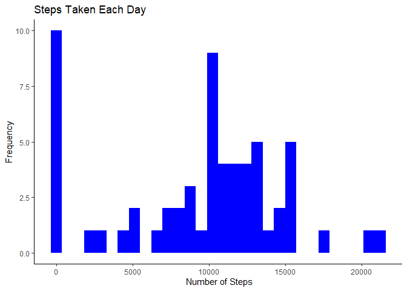
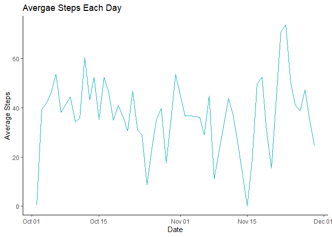
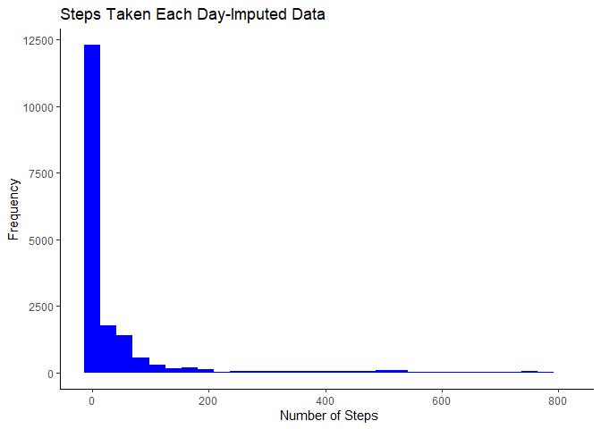
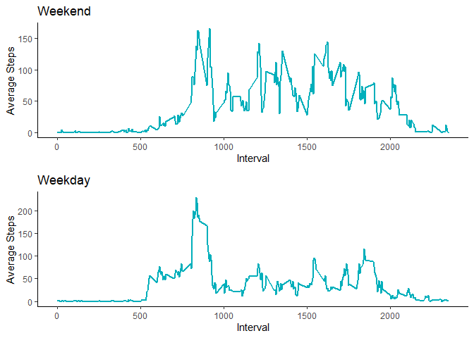
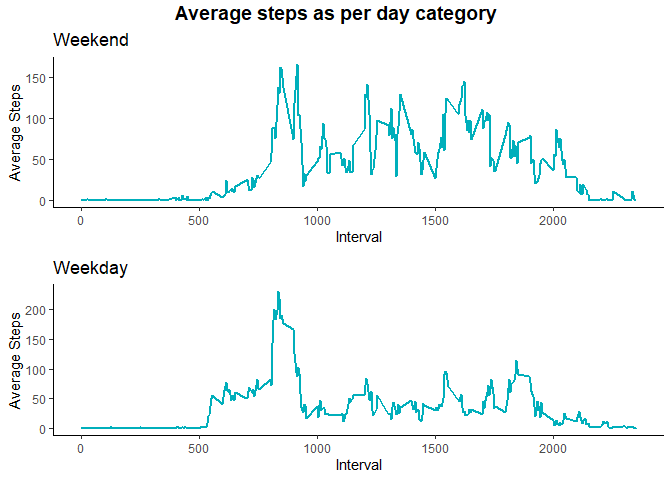

This document aims to analyze daily activity pattern recorded using an activity monitor.

##1-Read and process the data

```r
library(readr)
data <- read_csv("activity.csv", col_types = cols(date = col_date(format = "%m/%d/%Y")))
```

##2-The total number of steps taken each day

```r
sum <- data.frame(tapply(data$steps,data$date,sum,na.rm=TRUE))
date <- data.frame(date=as.Date(row.names(sum)))
names(sum)[[1]]<-"TotalSteps"
```
Histogram for steps taken each day

```r
library(ggplot2)
ggplot(sum,aes(TotalSteps))+
  geom_histogram(fill="blue")+
  labs(title="Steps Taken Each Day",x=" Number of Steps", 
       y ="Frequency")+  
  theme_classic()
```

```
## `stat_bin()` using `bins = 30`. Pick better value with `binwidth`.
```

<!-- -->

##3.	Mean and median number of steps taken each day
Mean

```r
mean(sum$TotalSteps)
```

```
## [1] 9354.23
```
Median

```r
median(sum$TotalSteps)
```

```
## [1] 10395
```

##4.  Time series plot of the average number of steps taken

```r
#Calculate average for number of steps taken in each interval
Ave <- data.frame(AveSteps=round(tapply(data$steps, data$date,mean),2), na.rm=TRUE)
Ave$date <- as.Date(row.names(Ave))
rownames(Ave) <- NULL
#remove na values form the data
Ave <- na.omit(Ave)
```
Time Series plot.

```r
ggplot(Ave, aes(date, AveSteps))+
  geom_line(color="#00AFBB", group=1)+
  labs(title="Avergae Steps Each Day",x="Date",y="Average Steps")+
  theme_classic()
```

<!-- -->

  ## 5 minute interval that had the maximum number of steps

```r
#subset the data to get the interval with the maximum number of steps
subset(data, steps==max(data$steps))
```

```
## # A tibble: 0 x 3
## # ... with 3 variables: steps <dbl>, date <date>, interval <dbl>
```

##6	Imputing missing data

```r
#Number of rows with NA
nrow(data[is.na(data$steps),])
```

```
## [1] 2304
```
There are many ways to impute missing data, hereI choose to fill NA values with mean of data

```r
#Create a new dataset that is equal to the original dataset but with the missing data filled in.
StepsPerInterval <- round(tapply(data$steps, data$interval, mean, na.rm = TRUE),0)

#Split data data by interval
data.split <- split(data, data$interval)
#Create a for loop and fill in missing data for each interval
for(i in 1:length(data.split)){
  data.split[[i]]$steps[is.na(data.split[[i]]$steps)] <- StepsPerInterval[i]
  }
#Bind the split data with filled 'na' to get a new data set
newdata <- do.call("rbind", data.split)
newdata <- newdata[order(newdata$date) ,]
```

##7	Histogram of the total number of steps taken each day after missing values are imputed

```r
ggplot(newdata,aes(steps))+
  geom_histogram(fill="blue")+
  labs(title="Steps Taken Each Day-Imputed Data",
       x=" Number of Steps", 
       y ="Frequency")+
  theme_classic()
```

```
## `stat_bin()` using `bins = 30`. Pick better value with `binwidth`.
```

<!-- -->

```r
sum.imputed <- data.frame(tapply(newdata$steps, newdata$date,sum, na.rm=TRUE))
date <- data.frame(date=as.Date(row.names(sum.imputed)))
names(sum.imputed)[[1]]<-"TotalSteps"
```
Calculate and report the mean and median total number of steps taken per day. 
Mean

```r
mean(sum.imputed$TotalSteps)
```

```
## [1] 10765.64
```
Median

```r
median(sum.imputed$TotalSteps)
```

```
## [1] 10762
```

##8-	Panel plot comparing the average number of steps taken per 5-minute interval across weekdays and weekends


```r
library("gridExtra")
```

```
## Warning: package 'gridExtra' was built under R version 3.6.3
```

```r
#bring together the weekend and weekday plots
f<- grid.arrange(we, wd, ncol = 1, nrow = 2)  
```

<!-- -->

```r
library(ggpubr)
```

```
## Loading required package: magrittr
```

```
## 
## Attaching package: 'ggpubr'
```

```
## The following object is masked from 'package:plyr':
## 
##     mutate
```

```r
annotate_figure(f, top = text_grob("Average steps as per day category",
                          face = "bold", size = 14))
```

<!-- -->
